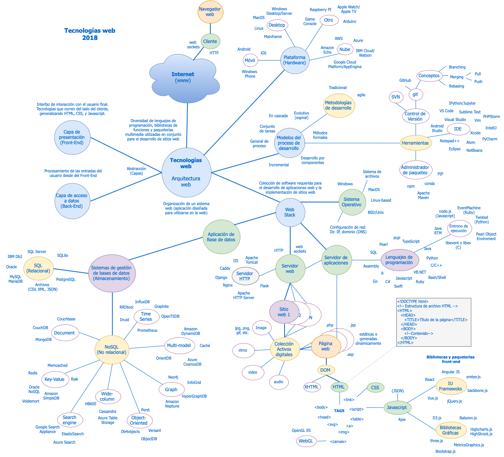

# Mapa de Tecnologías Web

## Referencias

> A Medium Corporation. (Feb de 2018). *Top JavaScript Libraries & Tech to Learn in 2018*. Recuperado el 05 de agosto de 2018, de [medium.com](https://medium.com/javascript-scene/top-javascript-libraries-tech-to-learn-in-2018-c38028e028e6)

> Collins. (2018). *Definiciones, Tesauro y Traducciones*. (HarperCollins Publishers) Obtenido de [Diccionario Inglés Collins](https://www.collinsdictionary.com/es/)

> Coding DOJO. (13 de diciembre de 2017). *The 7 Most In-Demand Programming Languages of 2018*. Recuperado el 03 de agosto de 2018, de [Coding DOJO](https://www.codingdojo.com/blog/7-most-in-demand-programming-languages-of-2018/)

> Git. (2018). Git. Recuperado el 06 de agosto de 2018, de https://git-scm.com

> IBM Corporation. (2014). *A typical client-server program flow chart*. Recuperado el 05 de agosto de 2018, de [IBM Knowledge Center](https://www.ibm.com/support/knowledgecenter/en/SSLTBW_2.1.0/com.ibm.zos.v2r1.halc001/o4ag1.htm)

> IEEE Spectrum. (31 de julio de 2018). *IEEE Spectrum’s fifth annual interactive ranking of the top programming languages*. Recuperado el 04 de agosto de 2018, de [spectrum.ieee.org]( https://spectrum.ieee.org/static/interactive-the-top-programming-languages-2018)

> IGI Global. (2018). Recuperado el 26 de 07 de 2018, de [IS&T Research Definitions](https://www.igi-global.com/dictionary/)

> I’m Programmer. (01 de febrero de 2018). *BEST NOSQL DATABASES 2018 – MOST POPULAR AMONG PROGRAMMERS*. Recuperado el 02 de Agosto de 2018, de [I’m Programmer](https://www.improgrammer.net/most-popular-nosql-database/)

> Mills, C. D. (08 de Apr de 2018). *What is a web server?*. Recuperado el 05 de Agosto de 2018, de [MDN web docs moz://a](https://developer.mozilla.org/en-US/docs/Learn/Common_questions/What_is_a_web_server)

> Oxford University Press. (2018). *English Dictionary, Thesaurus, & Grammar Help*. Recuperado el 18 de febrero de 2018, de [Oxford Dictionaries](https://en.oxforddictionaries.com/definition/)

> Pressman, R. S. (2010). *Ingeniería del software: Un enfoque práctico 7ma. Edición*. México.

> Real Academia Española [RAE]. (2017). Diccionario de la Real Acemdemia Española. Madrid: Real Academia Española.

> RedMonk. (07 de March de 2018). *The RedMonk Programming Language Rankings: January 2018*. Recuperado el 04 de agosto de 2018, de [redmonk.com](https://redmonk.com/sogrady/2018/03/07/language-rankings-1-18/)

> Refsnes Data. (2018). *w3schools.com*. Recuperado el 02 de agosto de 2018, de [w3schools.com](https://www.w3schools.com)

> solid IT gmbh. (August de 2018). *DB-Engines Ranking*. Recuperado el 06 de agosto de 2018, de [DB-Engines](https://db-engines.com/en/ranking)

> Stackoverflow. (2018). *Developer Survey Results 2018*. Recuperado el 06 de agosto de 2018, de [insights.stackoverflow.com](https://insights.stackoverflow.com/survey/2018)

> StackOverflow. (2018a). *Most popular databases in 2018 according to StackOverflow survey*. Obtenido de [eversql.com](https://www.eversql.com/most-popular-databases-in-2018-according-to-stackoverflow-survey/)

> Techopedia Inc. (2018). *Technology Dictionary*. Obtenido de [Techopedia](https://www.techopedia.com/dictionary)

> TechTarget. (2018). *The Tech Dictionary and IT Encyclopedia*. Recuperado el 06 de agosto de 2018, de [WhatIs.com](https://whatis.techtarget.com)

> The Khronos™ Group Inc. (2018). *OpenGL ES for the Web*. Recuperado el 19 de febrero de 2018, de [khronos.org](https://www.khronos.org/webgl/)

> TIOBE. (August de 2018). *TIOBE Index for August 2018*. Recuperado el 04 de agosto de 2018, de [tiobe.com](https://www.tiobe.com/tiobe-index/)

## Licencia

